# Chat Application
- Name: Shresth Deorari   
- University: IIT Patna  
- Department: Mathematics and Computing


## A real-time Group Chat Application With User Authentication And Admin Features.


## Features

 - User Sign-Up and Sign-In
 - Group Creation and Management
 - Real-Time Messaging
 - Role-Based Access Control


## Technology Stack

 - Frontend: React, Chakra UI
 - Backend: Node.js, Express.js
 - Database: MongoDB
 - Real-Time Communication: Socket.io
 - Authentication: JWT (JSON Web Tokens)


## Backend Dependencies

 - bcryptjs: Used for hashing passwords for secure storage.
 - colors: Adds colors to console logs for easier debugging.
 - dotenv: Loads environment variables from a .env file.
 - express: Core framework for building server-side logic.
 - express-async-handler: Handles async operations in Express routes.
 - jsonwebtoken: Creates and verifies JSON Web Tokens.
 - mongoose: ODM library for MongoDB, helping structure data.
 - socket.io: Library for real-time communication.


## Frontend Dependencies

 - @chakra-ui/react, @emotion/react, @emotion/styled: For building responsive UI with React components.
 - @testing-library: Tools for testing React components.
 - axios: Promise-based HTTP client for API requests.
 - framer-motion: Animation library for smooth UI transitions.
 - react, react-dom: Core libraries for building the frontend.
 - react-lottie: Adds Lottie animations to the UI.
 - react-router-dom: Routing library for client-side navigation.
 - react-scrollable-feed: For creating a scrollable chat feed.
 - socket.io-client: Client-side implementation for real-time communication.


## Architecture Design


## Frontend (React App)

 - **React Components**: Login, Chat Display, Message Input.
 - **State Management**: (Optional) Use Redux or Context API.
 - **Chakra UI**: For the design and UI.
 - **Axios**: For API communication with the backend.
 - **Socket.io-client**: For real-time updates and communication.
 - **React Router**: For navigating between different app pages.
 - **Animations**: Using Framer Motion and Lottie.
 - **Scrollable Feed**: For dynamic message feed scrolling.

   
## Backend (Node.js with Express)

 - **Express.js**: Core server-side framework.
 - **Routes**: API routes for authentication, messaging, and chat features.
 - **Controllers**: Business logic for API requests and socket events.
 - **Authentication**:
   - JWT (jsonwebtoken): User authentication via JSON Web Tokens.
   - bcryptjs: Password hashing.
 - **Socket.io**: Real-time chat system between users.
 - **Mongoose**: Interaction with MongoDB for storing user data and chat history.
 - **Models**: MongoDB schemas for users and chat messages.

   
## Database Layer (MongoDB)

 - **User Collection**: Stores user information like username and hashed password.
 - **Messages Collection**: Stores chat messages, sender/receiver info, and timestamps.
 - **Session Handling**: Optional management of user sessions.

   
## Middleware
 - **Authentication Middleware**: Checks JWTs to ensure users are authenticated.
 - **Error Handling Middleware**: Catches and responds to errors consistently.

   
## Architecture Diagram
 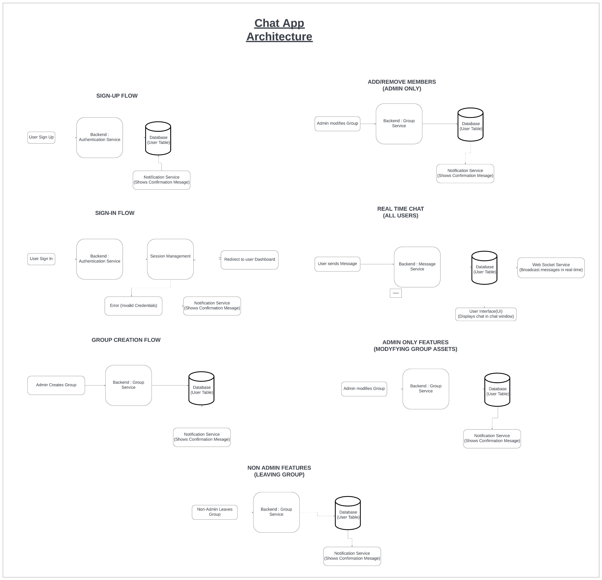


## Demo Images

### 1) App Opens - Login Page

 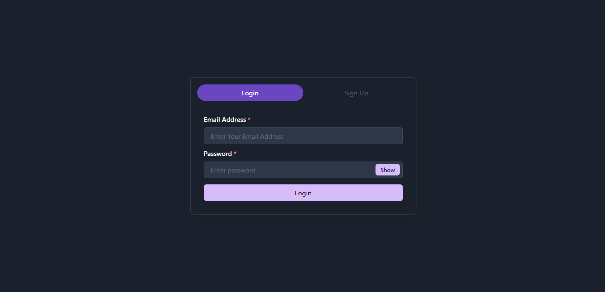

### 2) User Signup Interface

 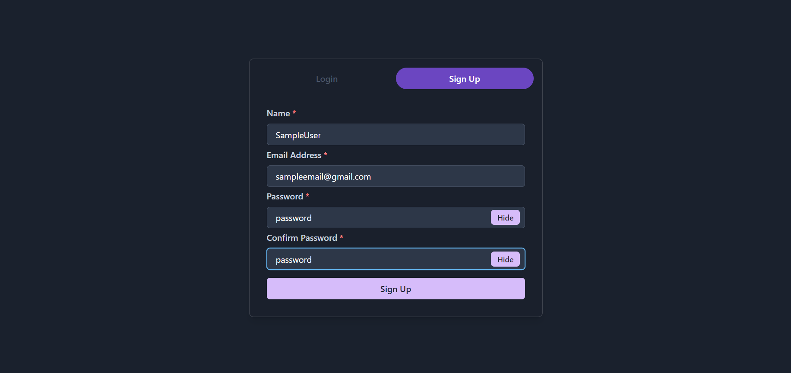

### 3) User Login

 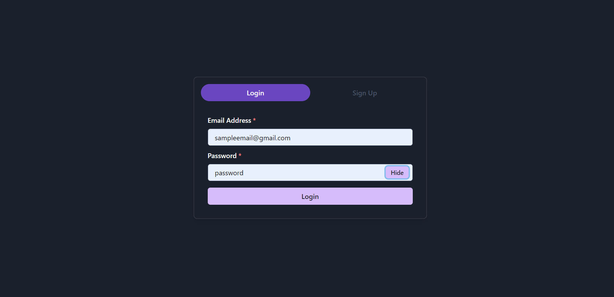

### 4) Main Dashboard

 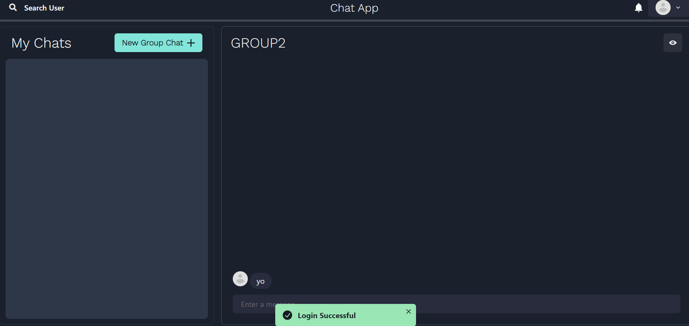

### 5) Creating a new Group

 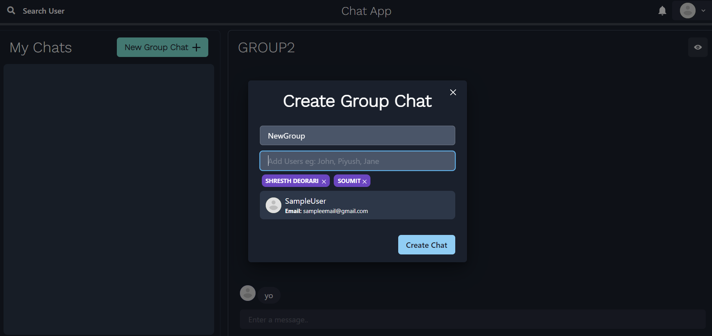

### 6) Chat with your friends and colleagues

 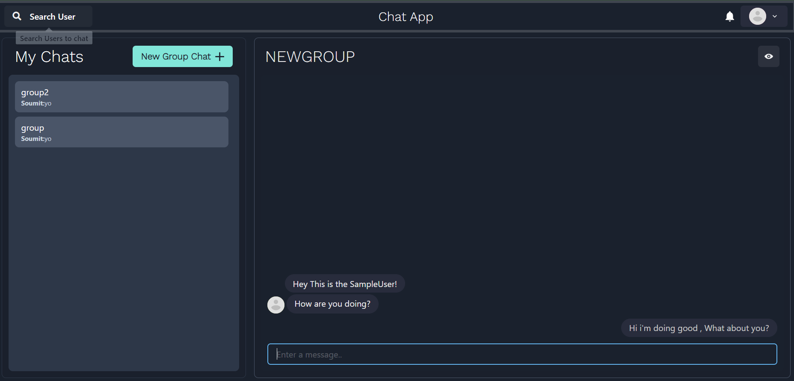

### 7) The profile button

 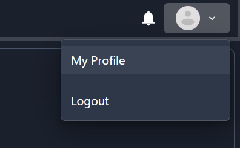

### 8) User Profile

 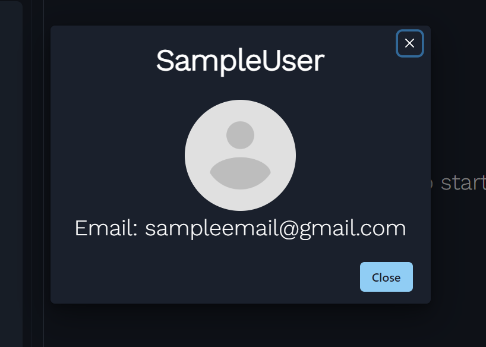

### 9) Group details

 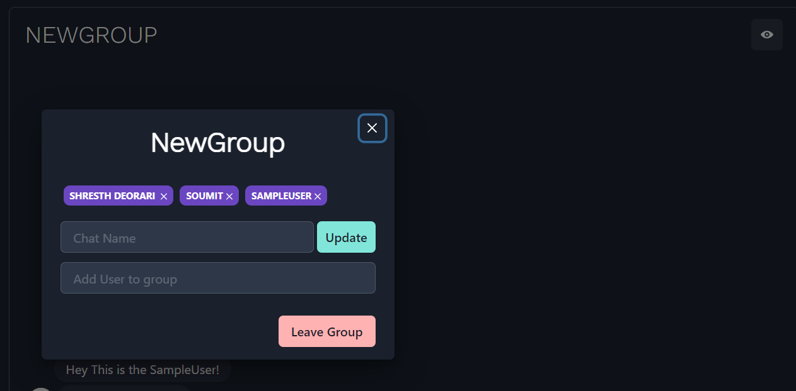

### 10) Non-Admin Cannot remove Other people, but can leave.

 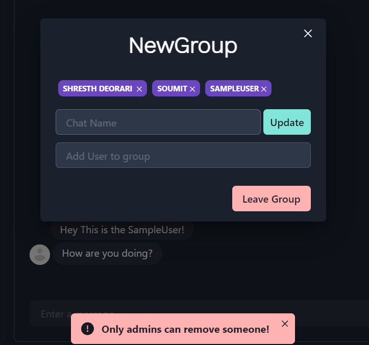


## Getting Started

### To get a local copy up and running, follow these steps.

## Prerequisites

 - Node.js
 - npm (Node Package Manager)
 - [Your database of choice]


## Installation

 1. Clone the repository
    ```bash
    git clone https://github.com/Shresth-Deorari/Chat_App.git
    ```
 2. Navigate to the project directory
    ```bash
    cd Chat_App
    ```
 3. Create a MongoDB account and create a cluster.
    - Go to [MongoDB Atlas](https://www.mongodb.com/cloud/atlas).
    - Follow the instructions to create an account and set up a new cluster.
    - Once your cluster is ready, set up a database for it.

 4. Get your connection string from MongoDB:
    - In your MongoDB Atlas dashboard, click on "Connect".
    - Choose "Connect your application".
    - Select the driver and version, then copy the provided connection string.
    - Replace `PASSWORD` in the connection string with your MongoDB database user's password.

 5. Create a `.env` file in the root directory and set up the following environment variables:
    ```plaintext
    MONGO_URI=[URI Provided by MongoDB]
    JWT_SECRET=mySuperSecretKey12345
    NODE_ENV=development
    PORT=5000
    SOCKET_IO_ORIGIN=http://localhost:3000
    FRONTEND_URL=http://localhost:3000
    ```

 6. Install dependencies in the root folder:
    ```bash
    npm install
    ```

 7. Navigate to the backend folder and install dependencies:
    ```bash
    cd backend
    npm install
    ```

 8. Navigate to the frontend folder and install dependencies:
    ```bash
    cd ../frontend
    npm install
    ```

 To run the application:

 9. In the backend folder, run the following command in the terminal:
    ```bash
    npm start
    ```
    This will start the backend and connect to the MongoDB server.

 10. In another terminal (without closing the backend), navigate back to the frontend folder:
    ```bash
    cd ../frontend
    ```
    Then run the following command:
    ```bash
    npm start
    ```
    This will start the frontend on `http://localhost:3000`, and you should be able to see the running website.


 The application will be running on `http://localhost:3000`.

 
## Usage

 - **User Registration**: Users can sign up by providing their name, email, and password.
 - **User Login**: Returning users can log in using their email and password.
 - **Group Management**: Admins can create and manage groups, while users can send messages and share files in real-time.
 - **Real-Time Notifications**: Users receive instant notifications for new messages and file uploads.

   
## Contributing

 Contributions are welcome! Please follow these steps:

 1. Fork the project
 2. Create your feature branch
    ```bash
    git checkout -b feature/AmazingFeature
    ```
 3. Commit your changes
    ```bash
    git commit -m 'Add some amazing feature'
    ```
 4. Push to the branch
    ```bash
    git push origin feature/AmazingFeature
    ```
 5. Open a pull request


## Contact

 - Shresth Deorari :
 - email : sahabrocker@gmail.com
 - linkedin : https://www.linkedin.com/in/shresth-deorari-iit-patna/
